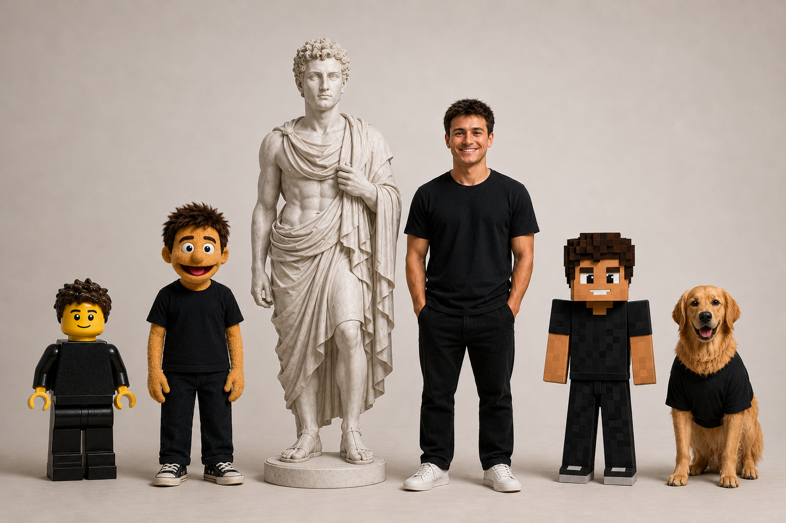

# Multiverse OS



## Description

Five coding variants built on the [Claude Agent SDK](https://docs.claude.com/en/docs/agent-sdk/overview). They share one persona markdown ("talks like me" / "codes like me") and differ by a per-variant personality.

| | Variant | Personality |
| --- | --- | --- |
| 🗿 | **Greco** (`greek`) | calm, measured, classical — timeless solutions over trendy ones |
| 🐕 | **Teddy** (`dog`) | loyal, eager, relentlessly encouraging |
| 🎭 | **Walter** (`muppet`) | warm, expressive, a little theatrical |
| 🧱 | **Emmet** (`lego`) | modular and methodical — snap-together, composable pieces |
| ⛏️ | **Steve** (`minecraft`) | high-energy, hype, Let's Play vibes |

Each variant owns a dedicated home directory at `workspace_root/<id>`. It clones repos in there itself, branches on `<id>/<task-slug>`, and commits/pushes independently. [src/guardrails.ts](src/guardrails.ts) blocks writes outside that directory, force-pushes, `rm -rf /`, and pushes to protected branches.

## Installation

```bash
bun install
cp .env.example .env     # fill in one credential (see Auth below)
```

### Auth — pick one

`.env` holds **only** secrets — one of these two credentials:

- **Claude subscription** (Pro/Max, recommended): mint an OAuth token with `claude setup-token` (needs [Claude Code](https://claude.ai/code) installed and logged in), then set `CLAUDE_CODE_OAUTH_TOKEN=sk-ant-oat01-…`. Bills against your plan, not API credits. Valid ~1 year; rerun `setup-token` to refresh.
- **Pay-as-you-go**: set `ANTHROPIC_API_KEY` instead. If both are present, the API key wins — leave it unset when using a subscription token.

Everything non-secret (variants, model, port, workspace root, protected branches) lives in [config.yaml](config.yaml).

## Usage

```bash
bun run web              # → http://localhost:3000
bun run chat             # terminal chat with the default variant
bun run chat greek       # terminal chat with a specific variant
```

Both go through the single entry point, [src/main.ts](src/main.ts) (`bun run src/main.ts <web | chat [variant]>`). Add `:dev` to the web script for auto-reload (`bun run web:dev`), or use `bun run dev` for the terminal.

The shared persona lives in [variant-config/andrew.identity.md](variant-config/andrew.identity.md) (how to talk) and [variant-config/andrew.coding.md](variant-config/andrew.coding.md) (how to code). Edit those to change every variant at once. Each variant's `variant-config/<id>.personality.md` changes just that one.

### Adding a variant

To add a variant you need three things:

1. An entry in the `variants:` list in [config.yaml](config.yaml) (`id`, `name`, `avatar`).
2. A `variant-config/<id>.personality.md` describing its personality.
3. A `profile-pics/<id>-andrew.png` avatar.

The sidebar, routing, and a home directory at `workspace_root/<id>` follow automatically.

## Development

```bash
bun run typecheck        # tsc on both the server and browser configs
bun run lint             # Biome lint + format check
bun run format           # Biome auto-format
```

[Biome](https://biomejs.dev) handles linting and formatting (config in [biome.json](biome.json)). GitHub Actions runs `lint` and `typecheck` on every push and pull request — see [.github/workflows/ci.yml](.github/workflows/ci.yml).

```
config.yaml            non-secret config: variants, model, port, workspace root
.env                   secrets only (auth token)
variant-config/
  andrew.identity.md   ← HOW EVERY ANDREW TALKS  (edit to change all)
  andrew.coding.md     ← HOW EVERY ANDREW CODES  (edit to change all)
  <id>.personality.md  ← who each variant is        (one per variant)
src/
  main.ts              single entry point (web | chat)
  config.ts            loads + types config.yaml
  persona.ts           assembles each variant's system prompt
  variant.ts           Variant class wrapping the SDK agent loop
  guardrails.ts        canUseTool: confinement + destructive-command blocking
  workspace.ts         ensures each variant's home directory exists
  chat.ts              terminal chat surface
  server.ts            Bun web server (variant list, profile pics, websocket per thread)
  web/index.html       browser chat UI (sidebar of variants + chat pane)
```
